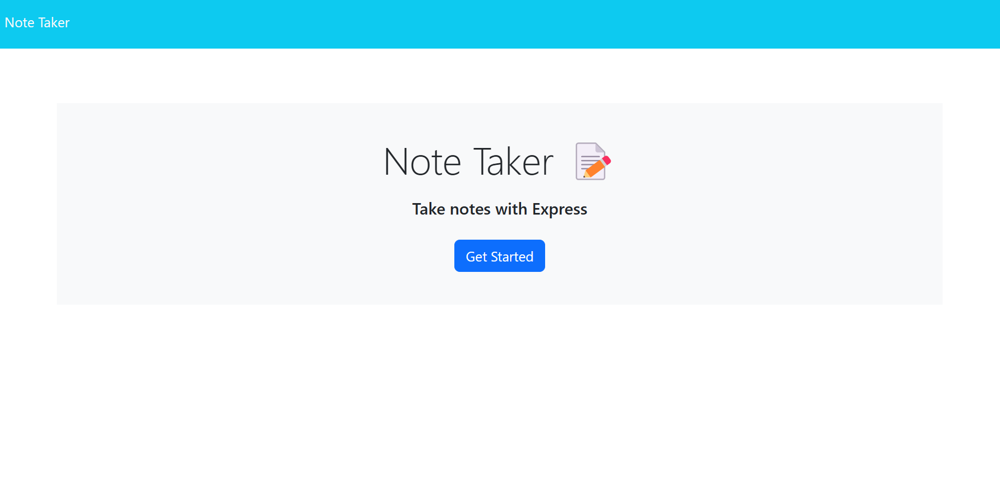

# Remind_Me

  

## Description

  This application was built with those of us who have a bad memory. With this Remind Me tool you will have all your notes and reminders in your hand easy to access. Simply create and delete reminders. That simple and easy.

## Table of Contents

- [Installation](#installation)
- [Usage](#usage)
- [Contributing](#contributing)
- [Tests](#tests)
- [License](#license)
- [Questions](#questions)

## Installation

  no need for any installation. You can get started by clicking the link provided [here](https://github.com/j-sniff) and you will be navigated to the application.

## Usage

  Type in the title and description of your reminder and click save. The application will remember your task until you have completed it. Once you have completed your task you can simply delete it with the trashcan icon.

  
  
## License

This project is licensed under the terms of the [MIT license](https://opensource.org/licenses/MIT).
    

## Questions

  If you have any questions, concerns, or comments please reachout to me on [Github](https://github.com/J-Sniff or at JacobSniff18@gmail.com).
